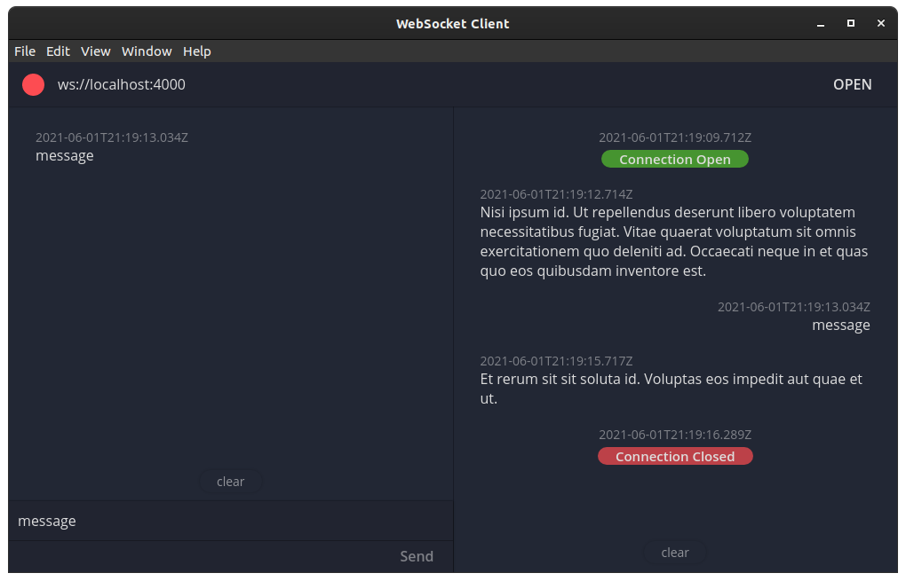

# WebSocket Client

[](https://opensource.org/licenses/MIT)
[](https://github.com/leonfoliveira/websocket-client/actions)
[](https://coveralls.io/github/leonfoliveira/websocket-client?branch=main)
[](https://opensource.org/)

A simple WebSocket client GUI, built on top of Electron.

## Preview



## Scripts

### Run in Development Mode

```
yarn dev
```

### Create a Production Build

```
yarn build
```

### Run in Production Mode

```
yarn start
```

## Download

### Linux

- [deb](https://drive.google.com/uc?export=download&id=1t0T1FppbwWcvDIu0U3WCwTxfNjRE0ro8)
- [rpm](https://drive.google.com/uc?export=download&id=19iOPsujNqqajbBEx0eZhdyUDHPamwcNF)
- [tar.gz](https://drive.google.com/uc?export=download&id=1jGePTiBUmjWTFtDOmigkVO6bm4DkkG6Z)

### Windows

- [Installer](https://drive.google.com/uc?export=download&id=1-wDzF5lqacfLSkj16nPeX4nrI8i4Cghq)
- [Portable](https://drive.google.com/uc?export=download&id=1Az2GzBVMtl5xB6pOnZWLaebNr1HhB4Uz)

## Planned Features

- JSON formatter
- Multiple Tabs
- [Socket.io](https://socket.io/) support
- Environment variables
- Connection options
- Mocked socket server creator
